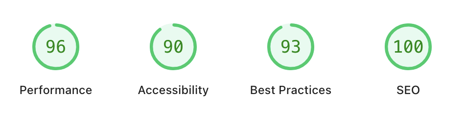
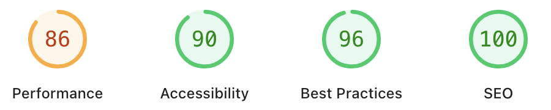

# Erdafa Andikri — Portfolio Website

A nostalgic Windows 95-themed portfolio website built with React + Vite, showcasing my journey as a Software Engineer and CS student at Universitas Indonesia.

## Live

| Environment | URL | Stack |
|-------------|-----|-------|
| Production | [dafandikri.tech](https://dafandikri.tech) | Vercel (CDN, auto-deploy) |
| Infra Demo | [k8s.dafandikri.tech](https://k8s.dafandikri.tech) | k3s on DigitalOcean Droplet |

## PageSpeed Insights

### Desktop



### Mobile



## Tech Stack

- **Frontend**: React 19, Vite, Bootstrap 5, Framer Motion
- **Routing**: React Router v7
- **Containerization**: Docker (multi-stage build, nginx-unprivileged)
- **Container Registry**: GitHub Container Registry (`ghcr.io`)
- **Orchestration**: k3s (lightweight Kubernetes) on DigitalOcean Droplet
- **Ingress / TLS**: Traefik v3 with Let's Encrypt ACME HTTP-01
- **CI/CD**: GitHub Actions — build → push → rolling restart

## Architecture

```
git push to main
    │
    ├── Vercel Git integration (unchanged)
    │       └── dafandikri.tech  (CDN, production)
    │
    └── GitHub Actions
            │
            ▼
        1. Build Docker image (TMDB_API_KEY baked in at build time,
           Letterboxd reviews fetched at build time via scripts/fetch-letterboxd.js)
        2. Push → ghcr.io/dafandikri/portfolio-website:latest
        3. SSH into DigitalOcean Droplet (159.223.49.141)
        4. k3s kubectl rollout restart deployment/portfolio-app -n portfolio
           (imagePullPolicy: Always re-pulls :latest on every restart)
        5. k3s kubectl rollout status ... --timeout=120s

Internet → :80/:443
         → Traefik v3 (k3s built-in, Let's Encrypt TLS)
         → portfolio-app Service ClusterIP :80
         → portfolio-app Pods :8080 (nginx-unprivileged, 2 replicas)
```

## Features

- Windows 95 aesthetic with retro UI components
- Smooth animations with Framer Motion
- Responsive design (mobile + desktop)
- **Blog** — sprint/project write-ups as routed pages
- **Letterboxd integration** — movie reviews fetched at build time via TMDB API
- Vercel Analytics + Speed Insights

## Development

### Prerequisites

- Node.js 22+
- npm

### Setup

```bash
# Clone
git clone https://github.com/dafandikri/portfolio-website.git
cd portfolio-website

# Install dependencies
npm install

# Start dev server
npm run dev
```

### Fetch Letterboxd Reviews (optional)

Requires a TMDB API key set as `TMDB_API_KEY` in your environment or `.env`.

```bash
npm run fetch-reviews
```

### Build for Production

```bash
# Build (without reviews)
npm run build

# Build with reviews fetched first
npm run build-with-reviews

# Preview production build locally
npm run preview
```

### Docker (local)

```bash
docker build --build-arg TMDB_API_KEY=your_key -t portfolio-website .
docker run -p 8080:8080 portfolio-website
# open http://localhost:8080
```

## CI/CD

Push to `main` triggers the GitHub Actions workflow (`.github/workflows/deploy.yml`):

1. Builds Docker image with `TMDB_API_KEY` injected
2. Pushes to `ghcr.io/dafandikri/portfolio-website:latest`
3. SSHes into Droplet and performs a rolling restart

**Required GitHub Secrets:**

| Secret | Description |
|--------|-------------|
| `TMDB_API_KEY` | TMDB API key for Letterboxd review fetching |
| `DROPLET_SSH_PRIVATE_KEY` | SSH private key for root@159.223.49.141 |

## Kubernetes Manifests (`k8s/`)

| File | Purpose |
|------|---------|
| `namespace.yaml` | `portfolio` namespace |
| `configmap.yaml` | Nginx config (SPA routing, `/healthz` endpoint) |
| `deployment.yaml` | 2 replicas, rolling update, resource limits, liveness/readiness probes |
| `service.yaml` | ClusterIP service on port 80 → pod port 8080 |
| `ingress.yaml` | Traefik ingress for `k8s.dafandikri.tech` with TLS |
| `traefik-config.yaml` | HelmChartConfig — Let's Encrypt ACME resolver + HTTP→HTTPS redirect |

## Future Updates

### Awards & Achievements Section

A dedicated section highlighting academic and professional accomplishments:

- Competition wins and recognitions
- Academic honors and scholarships
- Certifications and professional achievements
- Leadership roles and community contributions

### Interactive AI Assistant

Planning to integrate an intelligent chatbot so visitors can have a more personalized way to learn about my background and experience:

- **Conversational Interface** — a Windows 95-styled chat window (implemented as a shadcn/ui `Sheet` side panel) where visitors can ask questions about my projects, skills, and career journey
- **Streaming responses** — powered by [Vercel AI SDK](https://sdk.vercel.ai) using `useChat` from `@ai-sdk/react` with `DefaultChatTransport` for real-time streamed replies
- **Knowledge base** — grounded on my professional background, educational experience, and project details to provide accurate responses

### Hobbies

Planning to showcase hobbies through embedded content:

- Short films and creative projects
- ~~Letterboxd integration~~ ✅ Done — movie reviews now fetched at build time via TMDB API
- Games I've played and take a keen interest in
- Music, possibly integrating with Spotify or Apple Music
- Photographs I've taken
- ~~Bouldering/climbing progress and achievements~~ ✅ Done

### CV / Resume Section

Planning to add a CV/Resume section for visitors and potential recruiters to read and download.

### Blog Section ✅

~~Planning to add a blog section to give updates about myself~~ — shipped as routed pages (`/blog`, `/blog/:slug`) with Sprint write-ups.

---

## Contact

- **Email**: [dafandikri@gmail.com](mailto:dafandikri@gmail.com)
- **LinkedIn**: [linkedin.com/in/dafandikri](https://linkedin.com/in/dafandikri)
- **GitHub**: [github.com/dafandikri](https://github.com/dafandikri)
- **Instagram**: [@dafandikri](https://instagram.com/dafandikri)
- **Website**: [dafandikri.tech](https://dafandikri.tech)

## License

MIT — see [LICENSE](LICENSE).

---

**Built with React + Vite · Deployed on Vercel & k3s · Styled like it's 1995**
