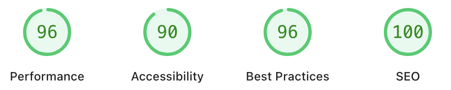

# Erdafa Andikri - Portfolio Website

A nostalgic Windows 95-themed portfolio website built with React and Vite, showcasing my journey as a Software Engineer and Problem Solver.

## PageSpeed Insights Results

### Desktop Performance



### Mobile Performance


## About Me

I'm **Erdafa Andikri**, a passionate Software Engineer and Computer Science student at the University of Indonesia. I specialize in full-stack development and creating innovative solutions that bridge technology with real-world problems.

## About This Website

This portfolio website is designed with a retro Windows 95 aesthetic, combining nostalgia with modern web technologies. It features smooth animations, responsive design, and interactive elements that showcase my projects, skills, and professional experience in an engaging format.

## Future Updates

### Awards & Achievements Section

Coming soon - a dedicated section highlighting my academic and professional accomplishments:

- Competition wins and recognitions
- Academic honors and scholarships
- Certifications and professional achievements
- Leadership roles and community contributions

### Interactive AI Assistant

Planning to integrate an intelligent chatbot that provides visitors with a more personalized way to learn about my background and experience:

- **Conversational Interface**: A Windows 95-styled chat window where visitors can ask questions about my projects, skills, and career journey
- **Knowledge Base**: AI trained on my professional background, educational experience, and project details to provide accurate and insightful responses

### Hobbies

Planning to showcase my hobby through embedded content:

- Short films and creative projects
- Integrating with letterboxd, so people can see my reviews through my website
- Games I have played and take a keen interest on
- Music and possibly integrating with Spotify/Apple Music
- Photographs I have taken
- Adding my bouldering/climbing progress and achievements

### CV/Resume Section

- Planning to put CV/Resume secion for visitors and potential recruites to read and download

### Blog Section

- Planning to add a blog section to give updates about myself

## Contact & Links

- **Email**: [dafandikri@gmail.com](mailto:dafandikri@gmail.com)
- **LinkedIn**: [linkedin.com/in/dafandikri](https://linkedin.com/in/dafandikri)
- **GitHub**: [github.com/dafandikri](https://github.com/dafandikri)
- **Instagram**: [@dafandikri](https://instagram.com/dafandikri)
- **Website**: [dafandikri.tech](https://dafandikri.tech)

## Development

### Prerequisites

- Node.js 18+
- npm or yarn

### Installation

```bash
# Clone the repository
git clone https://github.com/dafandikri/portfolio-website.git

# Navigate to project directory
cd portfolio-website

# Install dependencies
npm install

# Start development server
npm run dev
```

### Build for Production

```bash
# Build the project
npm run build

# Preview production build
npm run preview
```

### Deployment

The site is configured for Heroku deployment with static file serving. The build process generates optimized assets in the `dist` folder.

## License

This project is open source and available under the [MIT License](LICENSE).

---

**Built with ❤️ by Erdafa Andikri** | _Combining nostalgia with modern technology_
